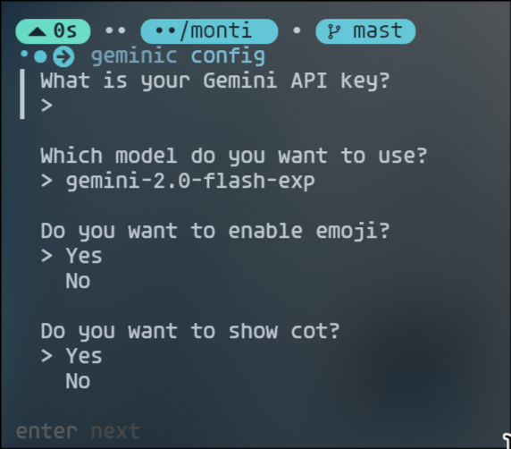
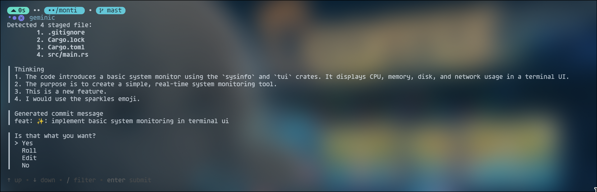

# Geminic
Using Gemini to Write Git Commits 

## Quick Start
### install
```shell
go install github.com/Beriholic/geminic@latest
```
### configuration
```shell
geminic config
```
Interactive configuration




Switching gemini models

```shell
geminic models
```

### usage
after git add files, you can use `geminic` to generate commit message

```shell
geminic
```



you can also give gemini commit references with -c
```shell
geminic -c "fix bug"
```

### help

```
Using Gemini to Write Git Commits

Usage:
  geminic [flags]
  geminic [command]

Available Commands:
  completion  Generate the autocompletion script for the specified shell
  config      Set the config file
  help        Help about any command
  models      select Gemini's model
  version     print the version of the geminic

Flags:
  -c, --commit string   commit message
  -h, --help            help for geminic

Use "geminic [command] --help" for more information about a command.
```

### Credits
  - Thank you Google for such a great [model](https://ai.google/get-started/for-developers)!
