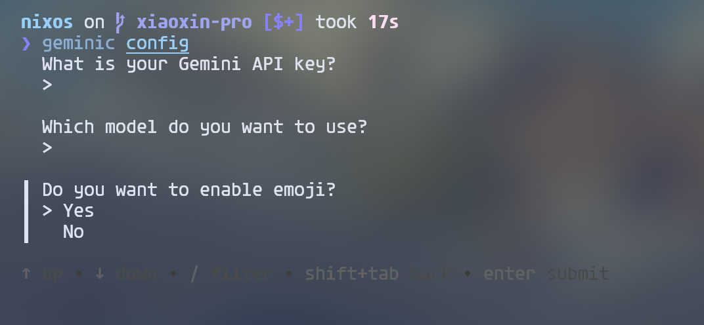
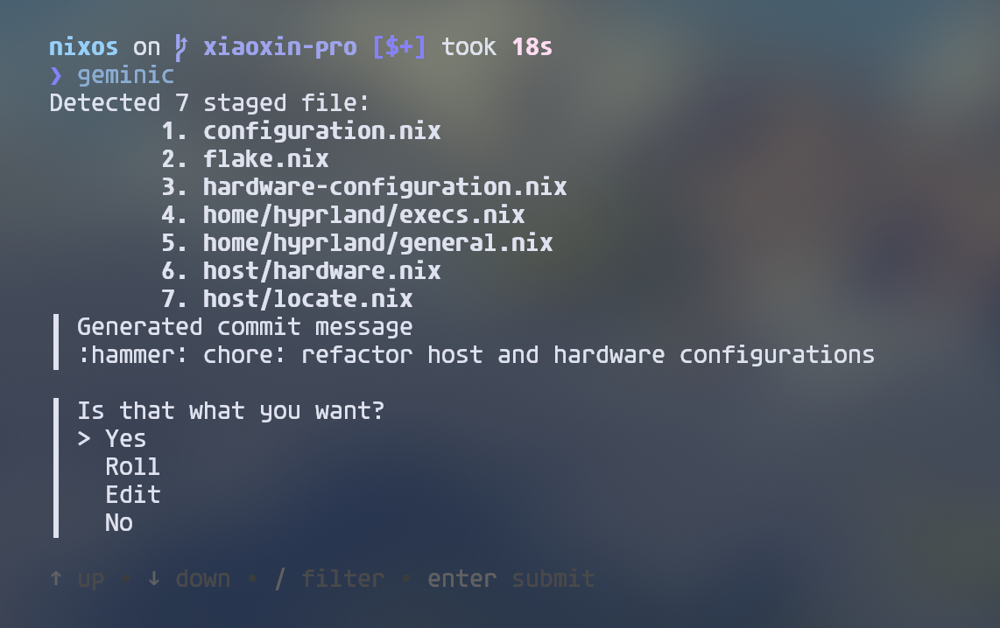

# Geminic
Using Gemini to Write Git Commits 

## Quick Start
### install
```shell
go install github.com/beriholic/geminic@0.3.0
```
### configuration
```shell
geminic config
```
Interactive configuration



> recommend to use 'gemini-2.0-flash-exp' model

### usage
after git add files, you can use `geminic` to generate commit message

```shell
geminic
```



you can also give gemini commit references with -c
```shell
geminic -c "fix bug"
```

### Credits
  - Thank you Google for such a great [model](https://ai.google/get-started/for-developers)!
